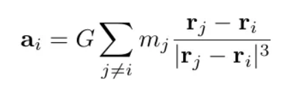

# 2D N-Body Simulations in Python using MPI  

This implementation is based on [this](https://medium.com/swlh/create-your-own-n-body-simulation-with-python-f417234885e9) Medium article, combined with [mpi4py](https://pypi.org/project/mpi4py/).

During every step, the node processes get the masses of the bodies and a slice of the bodies positions to calculate the accelerations of the bodies from the respective slice, based on Newton's law of universal gravitation. 



In the main loop, the calculated accelerations are reduced to the root process. The positions and velocities are updated using a leap-frog scheme, where first the velocity is updated after a half-step ('half-step kick'), followed by updating the positions ('drift'), and lastly another 'half-step kick'.

The simulation is plotted in real-time, and the performance is measured by the frames per second.

## Prerequisites

To run the simulation, you need to have [MPI](https://www.microsoft.com/en-us/download/details.aspx?id=105289) installed, as well as the [python library](https://pypi.org/project/mpi4py/) for it installed.

```bash
pip install mpi4py
```

## Usage 

```bash
mpiexec -n 4 python n_body_problem_distributed.py
```

Feel free to change the simulation parameters and the number of node processes.

## Benchmarks

```bash
+--------------------------------------------------------+
|           Benchmarks - dt = 1/60, t_end = 1            |
+-----------------+-----------+------------+-------------+
| Nr of processes | 10 bodies | 100 bodies | 1000 bodies |
+-----------------+-----------+------------+-------------+
|        1        |   17.03   |    8.59    |     0.18    |
|        2        |   16.74   |   10.94    |     0.34    |
|        4        |   15.47   |   11.89    |     0.45    |
|        8        |   15.34   |   12.59    |     0.74    |
+-----------------+-----------+------------+-------------+
```